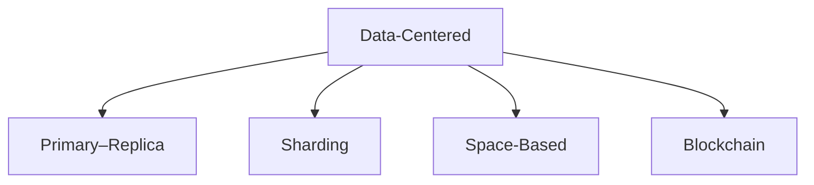
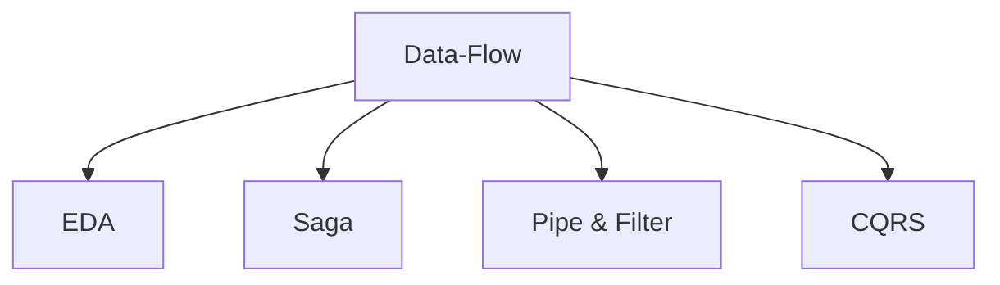
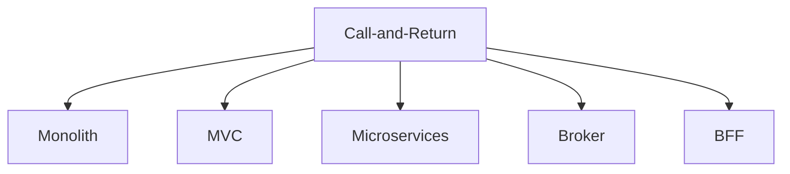
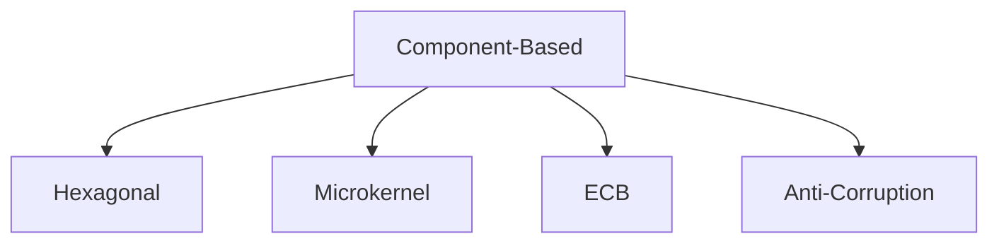
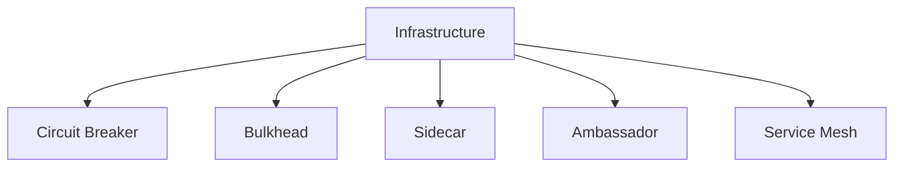
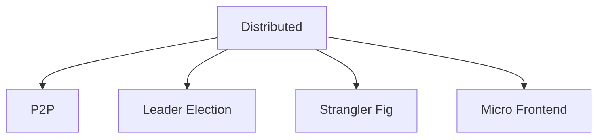

# 🏗️ Software Architecture Patterns

This section complements the article:

**📖 [30+ Software Architecture Patterns: A Practical Guide](https://jgcarmona.com/architecture-patterns)**  
> A visual-first reference for software architects, tech leads, and curious developers.

---

## 📊 Visual Overview

Below are the architecture patterns grouped by style. Click on each to explore real-world use cases, advantages, tradeoffs, and Mermaid diagrams.

### 🗃️ Data-Centered


### 🔄 Data-Flow


### 🔁 Call-and-Return


### 🧩 Component-Based


### 🛡️ Infrastructure


### 🌐 Distributed


---

## 📂 Directory Structure

Each pattern lives in its own `.md` file under its respective category. This is designed to scale and be easy to maintain. Feel free to contribute!

```
architecture/
├── data-centered/
├── data-flow/
├── call-and-return/
├── component-based/
├── infrastructure/
└── distributed/
```
---

## ✅ License

Creative Commons Attribution 4.0 International (CC BY 4.0).
You are free to share and adapt the material, even commercially — as long as you give appropriate credit.

Recommended attribution:

    “Diagrams and architectural patterns by Juan G Carmona (https://jgcarmona.com), licensed under CC BY 4.0.”

Contributions are welcome via pull requests.

See [LICENSE](/LICENSE)
