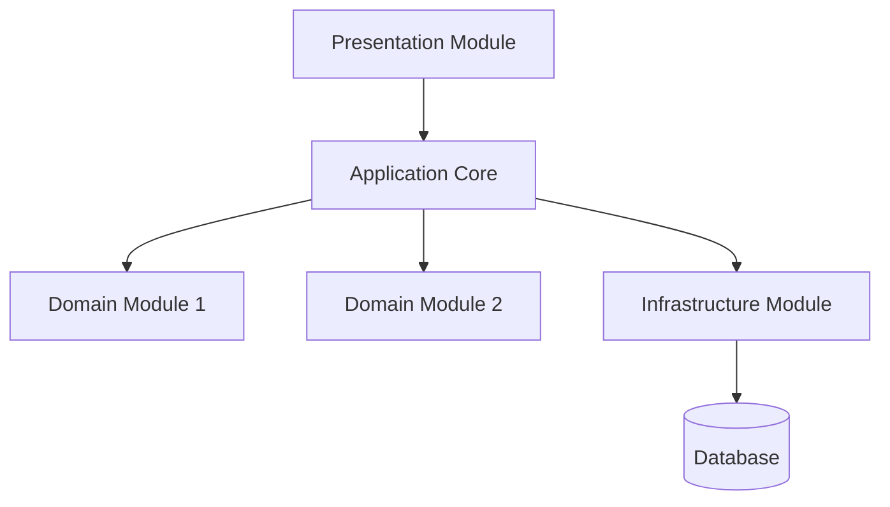

# [C/2] Modular Monolith

**Year**: Recent evolution (2010+)  
**Creator**: Gradual concept, influenced by SOA/layered modularity.

## Description

A modular monolith is a monolithic application that is divided into internal modules with clear boundaries, but deployed as a single unit. It allows teams to keep code organized and aligned to domains or business capabilities without incurring the cost and complexity of a distributed system.

## When to Use / Avoid

- ✅ **Use** when modular structure is important but microservice overhead is unjustified.
- ❌ **Avoid** if independent deployment or per-module scaling is critical.

## Use Cases

- Medium-sized applications with team/module separation
- Systems expected to grow but still manageable as a monolith

## Pros

- Maintains modularity without microservice complexity
- Easier to test and debug than distributed systems
- Still benefits from a single deployment unit

## Cons

- No per-module failure isolation
- Cannot scale individual modules independently
- Requires discipline to maintain boundaries

## Combinable With

- Hexagonal Architecture
- CQRS (Command Query Responsibility Segregation)
- Event-Driven Architecture (EDA)

## Evaluation

| Criteria            | Rating     |
|---------------------|------------|
| Implementation Ease | ★★★★☆ |
| Scalability         | ★★☆☆☆ |
| Performance         | ★★★★☆ |
| Adaptability        | ★★★☆☆ |
| Resilience          | ★★☆☆☆ |
| Cost                | ★★★★☆ |

---

## Mermaid Diagram: Modular Monolith Architecture

Each module is clearly separated in code (e.g., namespaces or packages) but compiled and deployed as a single executable/application.

---

## Example

A Spring Boot application with packages like `com.app.module.user`, `com.app.module.billing`, each exposing services via interfaces, communicating through events or method calls, but all deployed together.

Alternatively, a .NET monolith with bounded contexts in separate projects referenced in the main application.