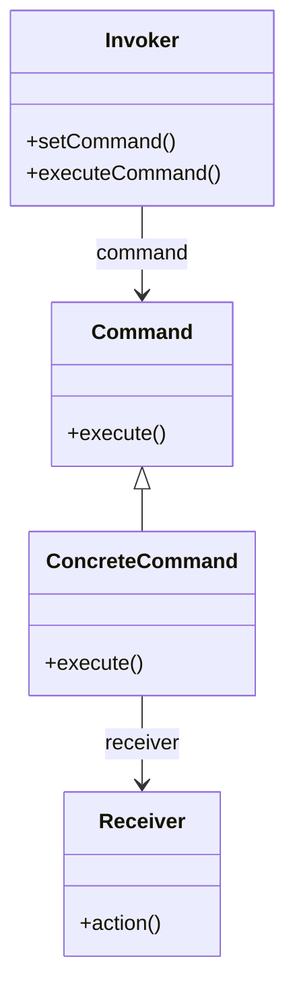

# Command

The **Command** pattern encapsulates a request as an object, allowing clients to be parameterized with different requests, queue or log requests, and support undoable operations. This pattern separates the object that invokes the operation from the one that knows how to perform it.

## Diagram

## Example

In this directory, you can find examples of how to implement the pattern in **C#** and **Python**, as well as a **Mermaid** diagram illustrating the basic structure of the pattern.

- **C#**: Example with classes implementing the Command pattern to execute operations in an encapsulated manner.
- **Python**: A similar example that shows how commands are encapsulated and executed dynamically.

**SPANISH VERSION / VERSIÓN EN ESPAÑOL:** For the Spanish version of this file, **click [here](README_ES.md)**.
