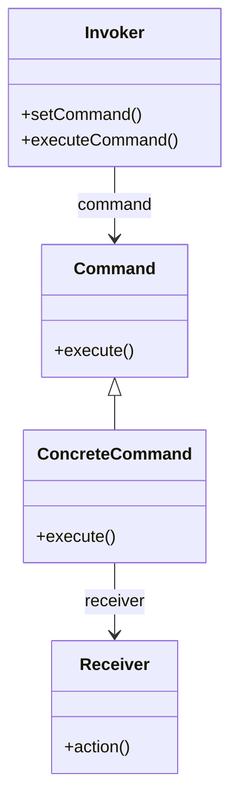

# Command

El patrón **Command** encapsula una solicitud como un objeto, lo que permite parametrizar a los clientes con diferentes solicitudes, encolar o registrar solicitudes, y soportar operaciones que pueden deshacerse. Este patrón separa al objeto que invoca una operación del que sabe cómo realizarla.

## Diagrama

## Ejemplo

En este directorio, puedes encontrar ejemplos de cómo implementar el patrón en **C#** y **Python**, así como un diagrama en **Mermaid** que ilustra la estructura básica del patrón.

- **C#**: Ejemplo con clases que implementan el patrón Command para ejecutar operaciones de forma encapsulada.
- **Python**: Ejemplo similar que muestra cómo los comandos se encapsulan y ejecutan dinámicamente.

**SPANISH VERSION / VERSIÓN EN ESPAÑOL:** Para la versión en inglés de este archivo, haz clic [aquí](README.md).
