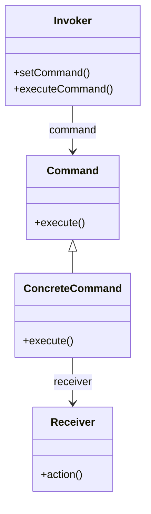

```mermaid
classDiagram
    class Command {
        +execute()
    }

    class ConcreteCommand {
        +execute()
    }

    class Invoker {
        +setCommand()
        +executeCommand()
    }

    class Receiver {
        +action()
    }

    Command <|-- ConcreteCommand
    ConcreteCommand --> Receiver : receiver
    Invoker --> Command : command
```