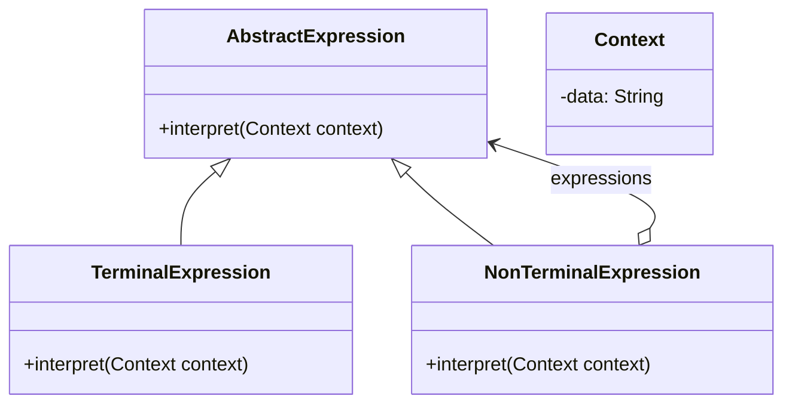

# Interpreter

The **Interpreter** pattern defines a grammatical representation for a language and uses an interpreter to interpret sentences in the language. This pattern is useful when the problem to be solved can be expressed as a set of simple grammatical rules.

## Diagram

## Example

In this directory, you can find examples of how to implement the pattern in **C#** and **Python**, as well as a **Mermaid** diagram illustrating the basic structure of the pattern.

- **C#**: Example with classes implementing a simple interpreter for evaluating expressions.
- **Python**: A similar example that shows how to dynamically interpret expressions.

**SPANISH VERSION / VERSIÓN EN ESPAÑOL:** For the Spanish version of this file, **click [here](README_ES.md)**.
