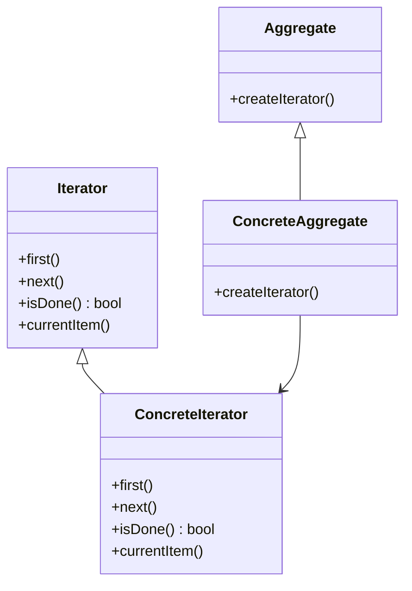

# Iterator

El patrón **Iterator** proporciona una forma de acceder secuencialmente a los elementos de un objeto agregado sin exponer su representación subyacente. Este patrón es útil cuando necesitas recorrer una colección de objetos de forma controlada.

## Diagrama

## Ejemplo

En este directorio, puedes encontrar ejemplos de cómo implementar el patrón en **C#** y **Python**, así como un diagrama en **Mermaid** que ilustra la estructura básica del patrón.

- **C#**: Ejemplo con clases que implementan un iterador simple para recorrer una lista de elementos.
- **Python**: Ejemplo similar que muestra cómo usar un iterador para recorrer una colección.

**SPANISH VERSION / VERSIÓN EN ESPAÑOL:** Para la versión en inglés de este archivo, haz clic [aquí](README.md).
