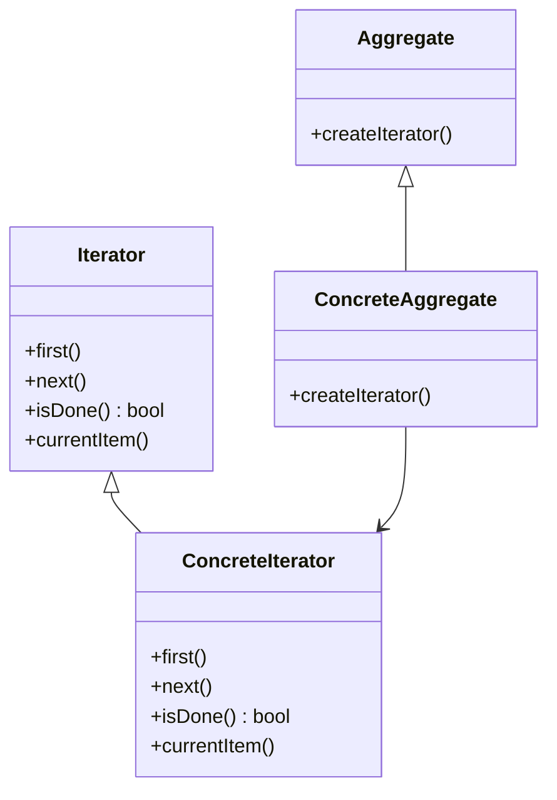

```mermaid
classDiagram
    class Iterator {
        +first()
        +next()
        +isDone() bool
        +currentItem()
    }

    class ConcreteIterator {
        +first()
        +next()
        +isDone() bool
        +currentItem()
    }

    class Aggregate {
        +createIterator()
    }

    class ConcreteAggregate {
        +createIterator()
    }

    Aggregate <|-- ConcreteAggregate
    Iterator <|-- ConcreteIterator
    ConcreteAggregate --> ConcreteIterator
```