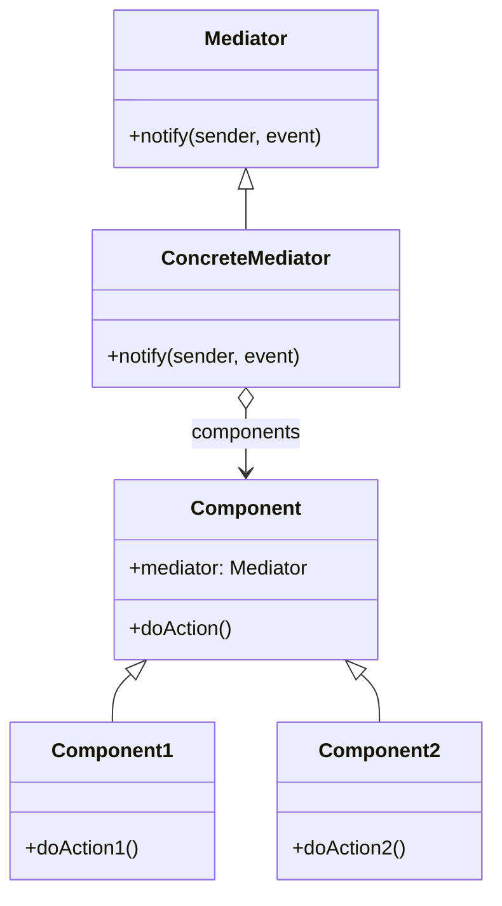

# Mediator

El patrón **Mediator** define un objeto que encapsula cómo interactúan un conjunto de objetos. Este patrón promueve el acoplamiento débil al evitar que los objetos se refieran directamente entre sí, lo que permite variar sus interacciones independientemente.

## Diagrama

## Ejemplo

En este directorio, puedes encontrar ejemplos de cómo implementar el patrón en **C#** y **Python**, así como un diagrama en **Mermaid** que ilustra la estructura básica del patrón.

- **C#**: Ejemplo con clases que implementan un mediador para coordinar la interacción entre varios componentes.
- **Python**: Ejemplo similar que muestra cómo los componentes interactúan a través de un mediador.

**SPANISH VERSION / VERSIÓN EN ESPAÑOL:** Para la versión en inglés de este archivo, haz clic [aquí](README.md).
