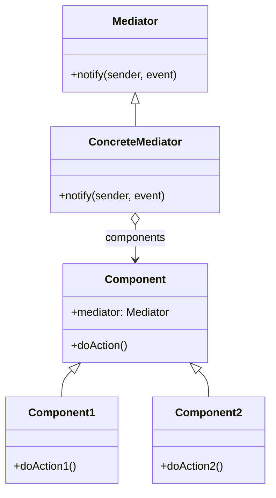

```mermaid
classDiagram
    class Mediator {
        +notify(sender, event)
    }

    class ConcreteMediator {
        +notify(sender, event)
    }

    class Component {
        +mediator: Mediator
        +doAction()
    }

    class Component1 {
        +doAction1()
    }

    class Component2 {
        +doAction2()
    }

    Mediator <|-- ConcreteMediator
    ConcreteMediator o--> Component : components
    Component <|-- Component1
    Component <|-- Component2
```
