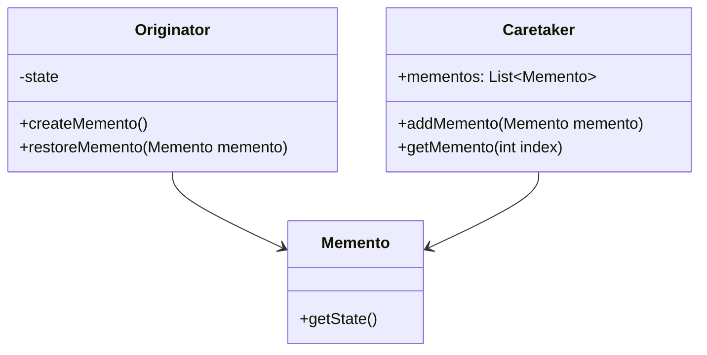

```mermaid
classDiagram
    class Memento {
        +getState()
    }

    class Originator {
        -state
        +createMemento()
        +restoreMemento(Memento memento)
    }

    class Caretaker {
        +mementos: List~Memento~
        +addMemento(Memento memento)
        +getMemento(int index)
    }

    Originator --> Memento
    Caretaker --> Memento
```
