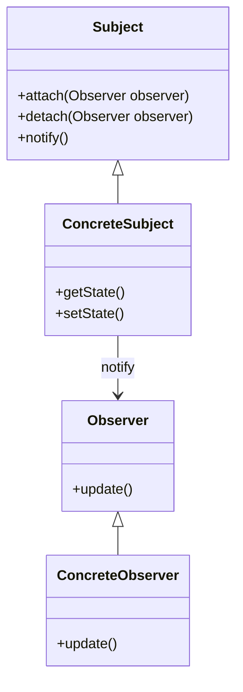

# Observer

El patrón **Observer** define una dependencia uno-a-muchos entre objetos, de manera que cuando un objeto cambia de estado, todos sus dependientes son notificados y actualizados automáticamente. Este patrón es útil cuando un cambio en un objeto necesita ser reflejado en otros objetos relacionados sin acoplarlos fuertemente.

## Diagrama

## Ejemplo

En este directorio, puedes encontrar ejemplos de cómo implementar el patrón en **C#** y **Python**, así como un diagrama en **Mermaid** que ilustra la estructura básica del patrón.

- **C#**: Ejemplo con clases que implementan el patrón Observer para actualizar observadores cuando el sujeto cambia.
- **Python**: Ejemplo similar que muestra cómo los observadores son notificados automáticamente cuando el sujeto cambia.

**SPANISH VERSION / VERSIÓN EN ESPAÑOL:** Para la versión en inglés de este archivo, haz clic [aquí](README.md).
