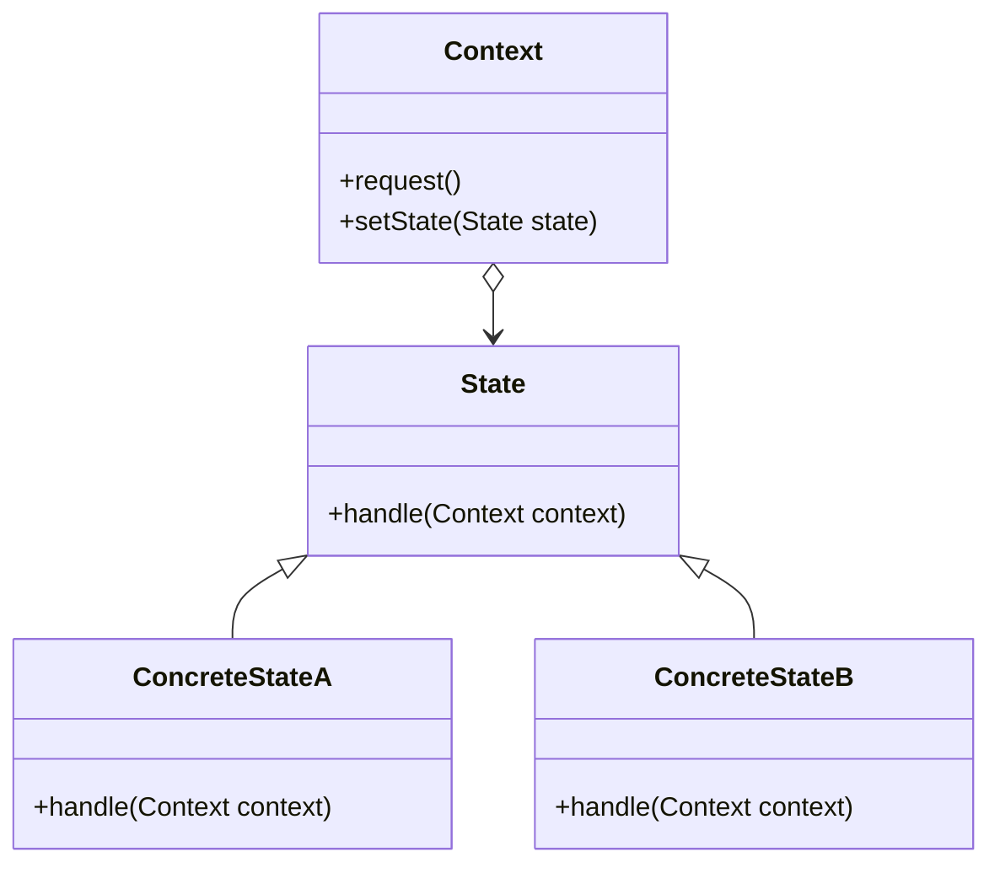

# State

El patrón **State** permite que un objeto altere su comportamiento cuando su estado interno cambia. El objeto parecerá cambiar su clase. Este patrón es útil cuando un objeto puede tener diferentes comportamientos según su estado y necesita cambiar dinámicamente entre ellos.

## Diagrama

## Ejemplo

En este directorio, puedes encontrar ejemplos de cómo implementar el patrón en **C#** y **Python**, así como un diagrama en **Mermaid** que ilustra la estructura básica del patrón.

- **C#**: Ejemplo con clases que implementan el patrón State para cambiar dinámicamente el comportamiento de un objeto según su estado.
- **Python**: Ejemplo similar que muestra cómo los objetos cambian su comportamiento basado en su estado.

**SPANISH VERSION / VERSIÓN EN ESPAÑOL:** Para la versión en inglés de este archivo, haz clic [aquí](README.md).
