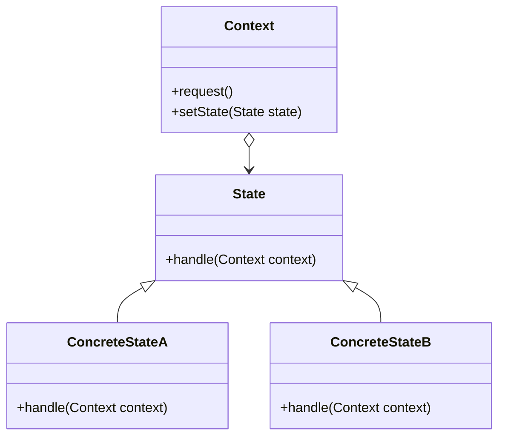

```mermaid
classDiagram
    class Context {
        +request()
        +setState(State state)
    }

    class State {
        +handle(Context context)
    }

    class ConcreteStateA {
        +handle(Context context)
    }

    class ConcreteStateB {
        +handle(Context context)
    }

    Context o--> State
    State <|-- ConcreteStateA
    State <|-- ConcreteStateB
```
