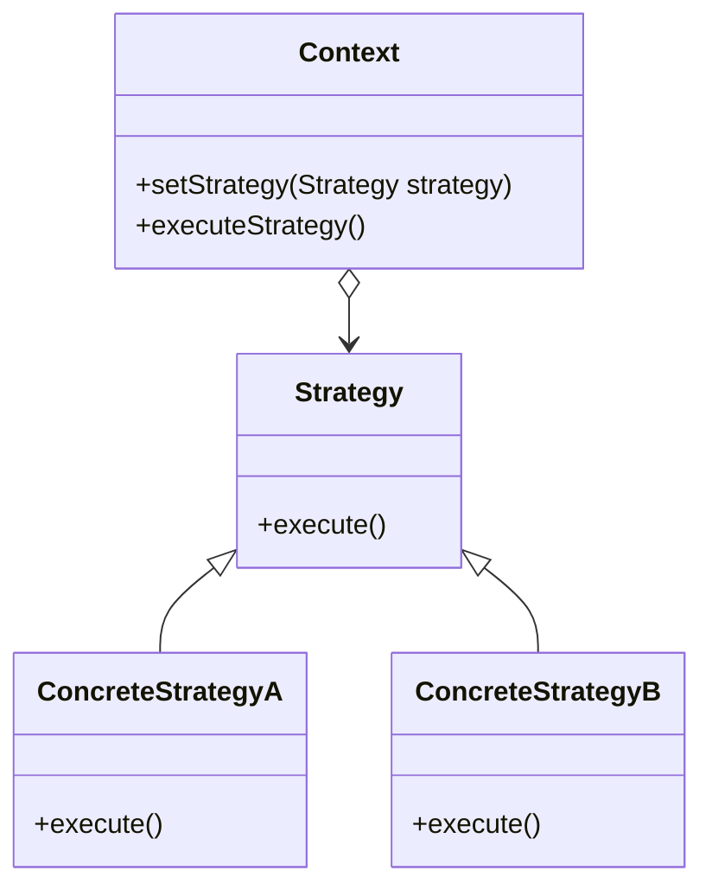

# Strategy

The **Strategy** pattern defines a family of algorithms, encapsulates each one, and makes them interchangeable. This pattern allows algorithms to vary independently from the clients that use them.

## Diagram

## Example

In this directory, you can find examples of how to implement the pattern in **C#** and **Python**, as well as a **Mermaid** diagram illustrating the basic structure of the pattern.

- **C#**: Example with classes implementing the Strategy pattern to dynamically switch between different algorithms.
- **Python**: A similar example that shows how algorithms can be swapped and executed dynamically.

**SPANISH VERSION / VERSIÓN EN ESPAÑOL:** For the Spanish version of this file, **click [here](README_ES.md)**.
