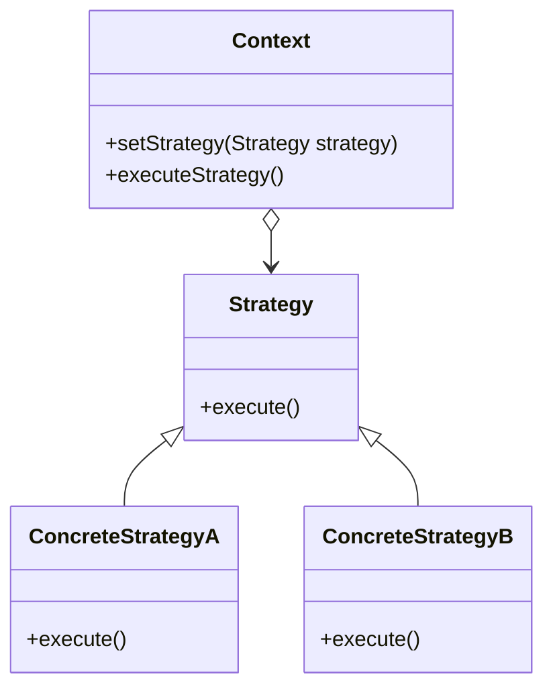

# Strategy

El patrón **Strategy** define una familia de algoritmos, encapsula cada uno de ellos y los hace intercambiables. Este patrón permite que los algoritmos varíen independientemente de los clientes que los usan.

## Diagrama

## Ejemplo

En este directorio, puedes encontrar ejemplos de cómo implementar el patrón en **C#** y **Python**, así como un diagrama en **Mermaid** que ilustra la estructura básica del patrón.

- **C#**: Ejemplo con clases que implementan el patrón Strategy para intercambiar diferentes algoritmos de forma dinámica.
- **Python**: Ejemplo similar que muestra cómo los algoritmos pueden ser intercambiados y ejecutados dinámicamente.

**SPANISH VERSION / VERSIÓN EN ESPAÑOL:** Para la versión en inglés de este archivo, haz clic [aquí](README.md).
