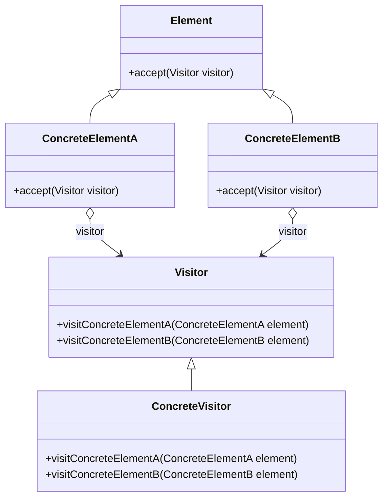

```mermaid
classDiagram
    class Visitor {
        +visitConcreteElementA(ConcreteElementA element)
        +visitConcreteElementB(ConcreteElementB element)
    }

    class ConcreteVisitor {
        +visitConcreteElementA(ConcreteElementA element)
        +visitConcreteElementB(ConcreteElementB element)
    }

    class Element {
        +accept(Visitor visitor)
    }

    class ConcreteElementA {
        +accept(Visitor visitor)
    }

    class ConcreteElementB {
        +accept(Visitor visitor)
    }

    Visitor <|-- ConcreteVisitor
    Element <|-- ConcreteElementA
    Element <|-- ConcreteElementB
    ConcreteElementA o--> Visitor : visitor
    ConcreteElementB o--> Visitor : visitor
```
