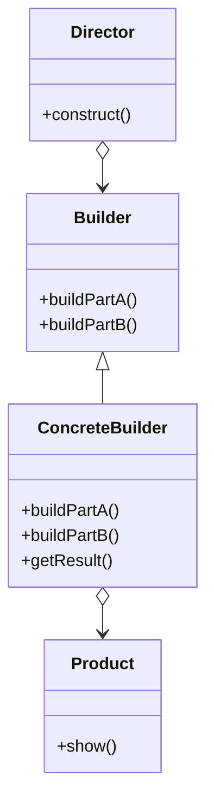

# Builder

The **Builder** pattern separates the construction of a complex object from its representation, allowing the same construction process to create different representations. It's useful when the creation of an object involves several steps.

## Diagram

## Example

In this directory, you can find examples of how to implement the pattern in **C#** and **Python**, as well as a **Mermaid** diagram illustrating the basic structure of the pattern.

- **C#**: Example with classes implementing the Builder pattern to construct a product step by step.
- **Python**: A similar example that shows how to build a complex object in different stages.

**SPANISH VERSION / VERSIÓN EN ESPAÑOL:** For the Spanish version of this file, **click [here](README_ES.md)**.
