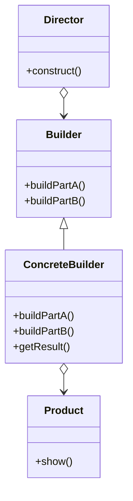

```mermaid
classDiagram
    class Director {
        +construct()
    }

    class Builder {
        +buildPartA()
        +buildPartB()
    }

    class ConcreteBuilder {
        +buildPartA()
        +buildPartB()
        +getResult()
    }

    class Product {
        +show()
    }

    Director o--> Builder
    Builder <|-- ConcreteBuilder
    ConcreteBuilder o--> Product
```
