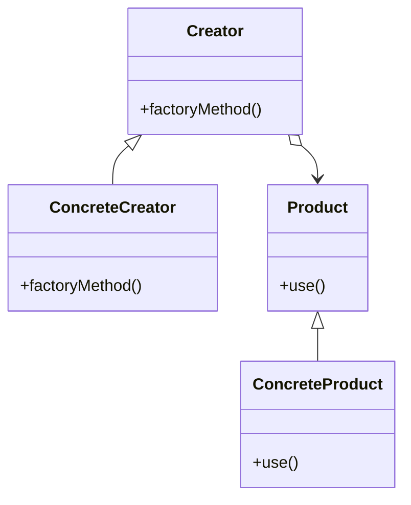

```mermaid
classDiagram
    class Creator {
        +factoryMethod()
    }

    class ConcreteCreator {
        +factoryMethod()
    }

    class Product {
        +use()
    }

    class ConcreteProduct {
        +use()
    }

    Creator o--> Product
    Creator <|-- ConcreteCreator
    Product <|-- ConcreteProduct
```
