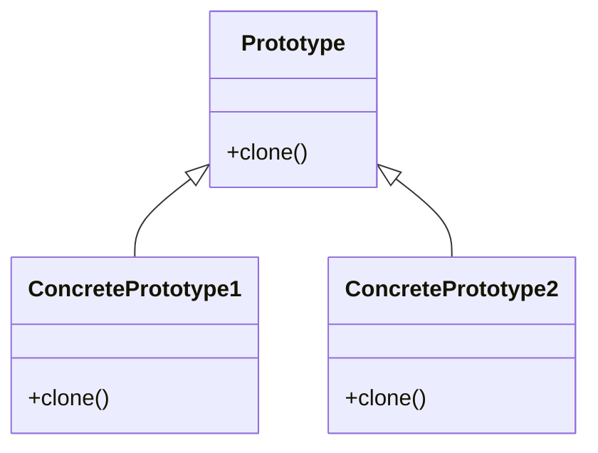

# Prototype

El patrón **Prototype** permite copiar objetos existentes sin depender de sus clases, lo que permite agregar o eliminar objetos en tiempo de ejecución. Este patrón es útil cuando la creación de objetos es costosa y se necesita copiar un objeto en lugar de crear uno nuevo desde cero.

## Diagrama

## Ejemplo

En este directorio, puedes encontrar ejemplos de cómo implementar el patrón en **C#** y **Python**, así como un diagrama en **Mermaid** que ilustra la estructura básica del patrón.

- **C#**: Ejemplo con clases que implementan el patrón Prototype para clonar objetos sin crear instancias desde cero.
- **Python**: Ejemplo similar que muestra cómo copiar objetos existentes usando el patrón Prototype.

**SPANISH VERSION / VERSIÓN EN ESPAÑOL:** Para la versión en inglés de este archivo, haz clic [aquí](README.md).
