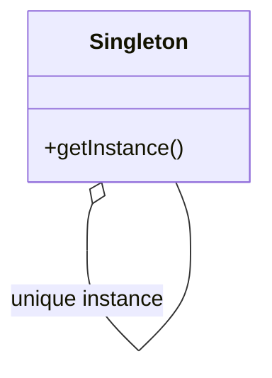

# Singleton

El patrón **Singleton** asegura que una clase tenga una única instancia y proporciona un punto de acceso global a dicha instancia. Este patrón es útil cuando se necesita controlar el acceso a un recurso compartido o garantizar que un objeto tenga una única instancia en todo el sistema.

## Diagrama

## Ejemplo

En este directorio, puedes encontrar ejemplos de cómo implementar el patrón en **C#** y **Python**, así como un diagrama en **Mermaid** que ilustra la estructura básica del patrón.

- **C#**: Ejemplo con clases que implementan el patrón Singleton para controlar la creación de instancias de una clase.
- **Python**: Ejemplo similar que muestra cómo garantizar una única instancia de una clase usando el patrón Singleton.

**SPANISH VERSION / VERSIÓN EN ESPAÑOL:** Para la versión en inglés de este archivo, haz clic [aquí](README.md).
