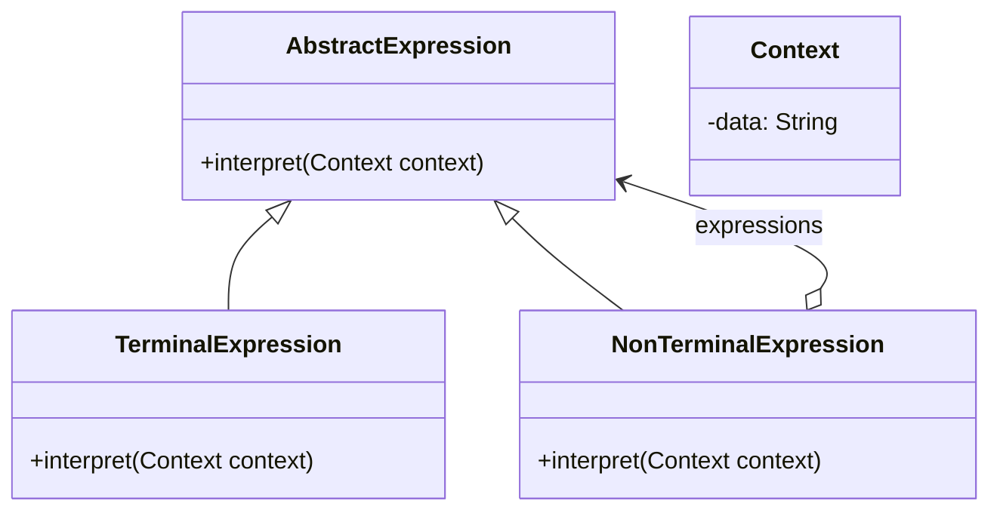

# Interpreter

El patrón **Interpreter** define una representación gramatical para un lenguaje y utiliza un intérprete para interpretar oraciones de dicho lenguaje. Este patrón es útil cuando el problema a resolver se puede expresar como un conjunto de reglas gramaticales simples.

## Diagrama

## Ejemplo

En este directorio, puedes encontrar ejemplos de cómo implementar el patrón en **C#** y **Python**, así como un diagrama en **Mermaid** que ilustra la estructura básica del patrón.

- **C#**: Ejemplo con clases que implementan un intérprete simple para evaluar expresiones.
- **Python**: Ejemplo similar que muestra cómo interpretar expresiones de manera dinámica.

**SPANISH VERSION / VERSIÓN EN ESPAÑOL:** Para la versión en inglés de este archivo, haz clic [aquí](README.md).
