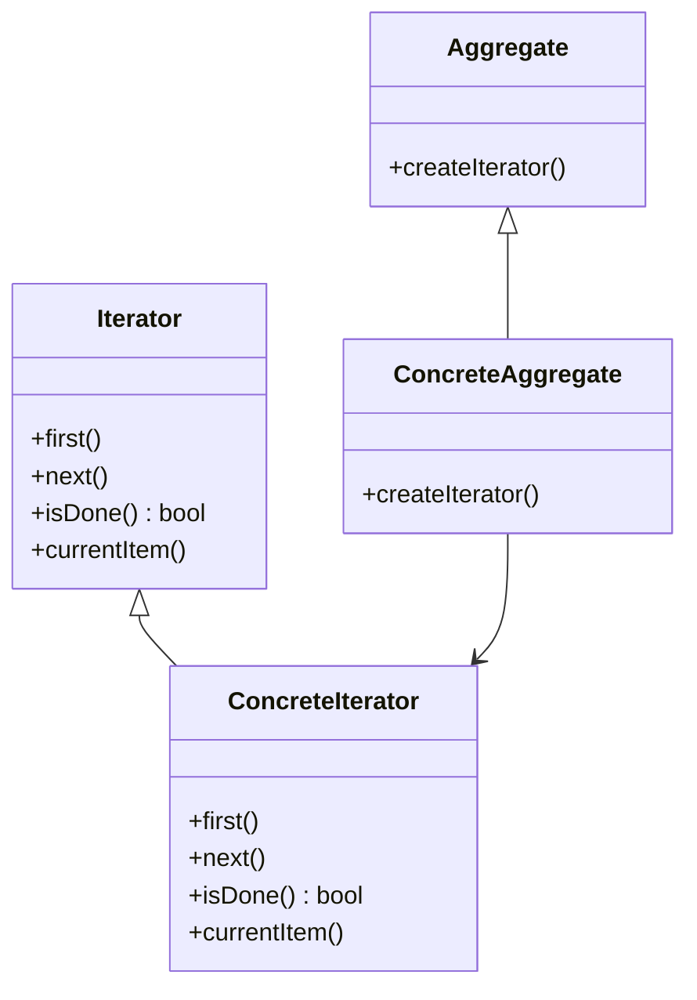

# Iterator

The **Iterator** pattern provides a way to sequentially access the elements of an aggregate object without exposing its underlying representation. This pattern is useful when you need to traverse a collection of objects in a controlled manner.

## Diagram

## Example

In this directory, you can find examples of how to implement the pattern in **C#** and **Python**, as well as a **Mermaid** diagram illustrating the basic structure of the pattern.

- **C#**: Example with classes implementing a simple iterator to traverse a list of items.
- **Python**: A similar example that shows how to use an iterator to traverse a collection.

**SPANISH VERSION / VERSIÓN EN ESPAÑOL:** For the Spanish version of this file, **click [here](README_ES.md)**.
