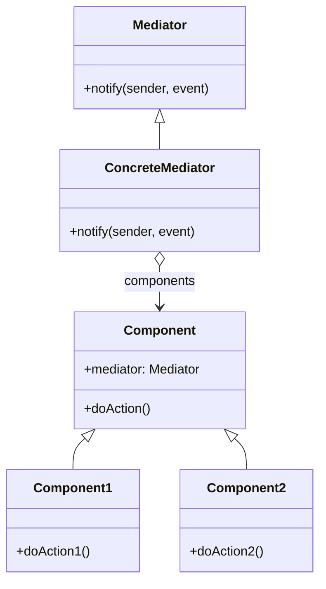

# Mediator

The **Mediator** pattern defines an object that encapsulates how a set of objects interact. This pattern promotes loose coupling by keeping objects from referring to each other explicitly, allowing their interactions to vary independently.

## Diagram

## Example

In this directory, you can find examples of how to implement the pattern in **C#** and **Python**, as well as a **Mermaid** diagram illustrating the basic structure of the pattern.

- **C#**: Example with classes implementing a mediator to coordinate interaction between multiple components.
- **Python**: A similar example that shows how components interact through a mediator.

**SPANISH VERSION / VERSIÓN EN ESPAÑOL:** For the Spanish version of this file, **click [here](README_ES.md)**.
