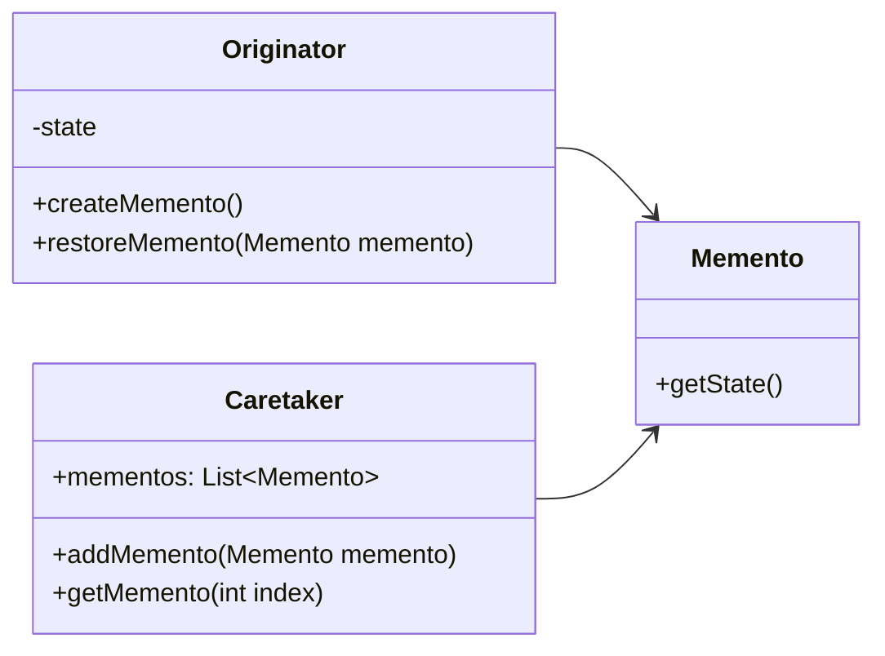

# Memento

The **Memento** pattern allows you to capture and externalize an object's internal state without violating encapsulation, so the object can be restored to this state later. This pattern is useful when you need to undo operations or store states efficiently.

## Diagram

## Example

In this directory, you can find examples of how to implement the pattern in **C#** and **Python**, as well as a **Mermaid** diagram illustrating the basic structure of the pattern.

- **C#**: Example with classes implementing a memento to store and restore an object's state.
- **Python**: A similar example that shows how states can be stored and retrieved using a memento.

**SPANISH VERSION / VERSIÓN EN ESPAÑOL:** For the Spanish version of this file, **click [here](README_ES.md)**.
