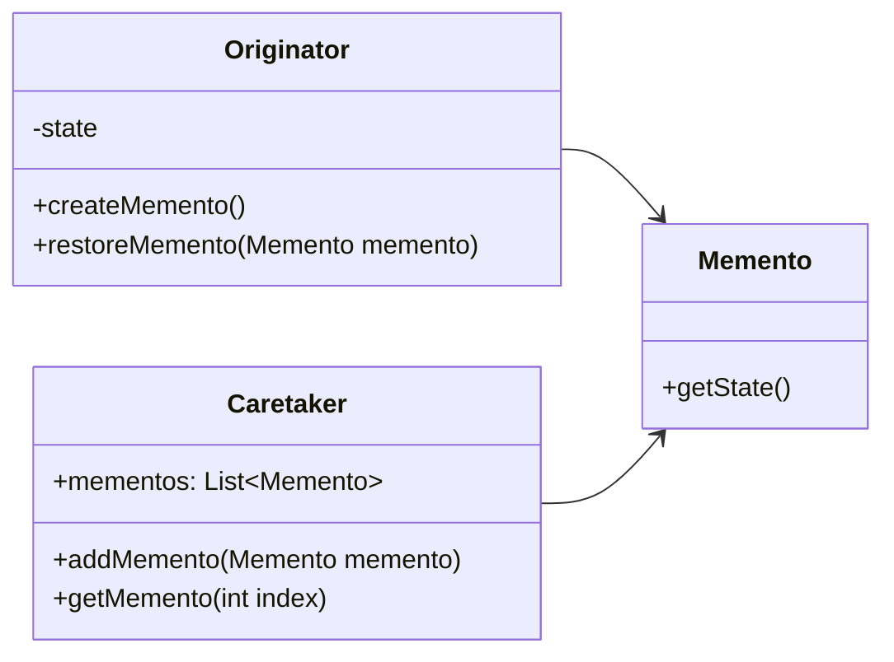

# Memento

El patrón **Memento** permite capturar y externalizar el estado interno de un objeto sin violar la encapsulación, para que el objeto pueda restaurarse a este estado más tarde. Este patrón es útil cuando necesitas deshacer operaciones o almacenar estados de manera eficiente.

## Diagrama

## Ejemplo

En este directorio, puedes encontrar ejemplos de cómo implementar el patrón en **C#** y **Python**, así como un diagrama en **Mermaid** que ilustra la estructura básica del patrón.

- **C#**: Ejemplo con clases que implementan un memento para almacenar y restaurar el estado de un objeto.
- **Python**: Ejemplo similar que muestra cómo los estados se pueden almacenar y recuperar mediante un memento.

**SPANISH VERSION / VERSIÓN EN ESPAÑOL:** Para la versión en inglés de este archivo, haz clic [aquí](README.md).
