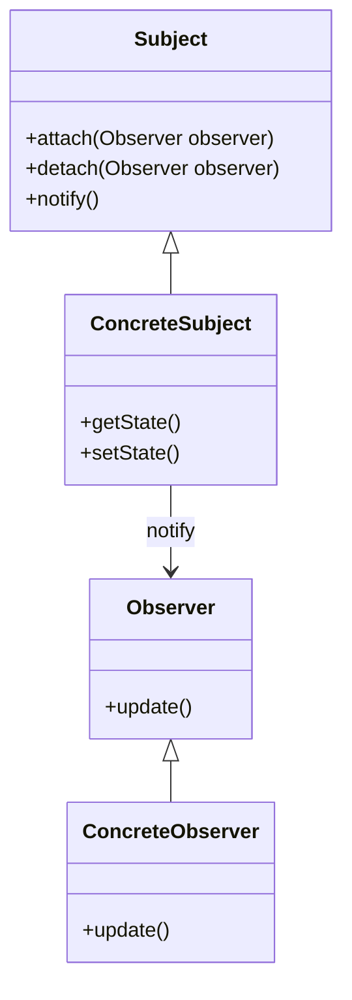

# Observer

The **Observer** pattern defines a one-to-many dependency between objects so that when one object changes state, all its dependents are notified and updated automatically. This pattern is useful when a change in one object needs to be reflected in other related objects without tightly coupling them.

## Diagram

## Example

In this directory, you can find examples of how to implement the pattern in **C#** and **Python**, as well as a **Mermaid** diagram illustrating the basic structure of the pattern.

- **C#**: Example with classes implementing the Observer pattern to update observers when the subject changes.
- **Python**: A similar example that shows how observers are automatically notified when the subject changes.

**SPANISH VERSION / VERSIÓN EN ESPAÑOL:** For the Spanish version of this file, **click [here](README_ES.md)**.
