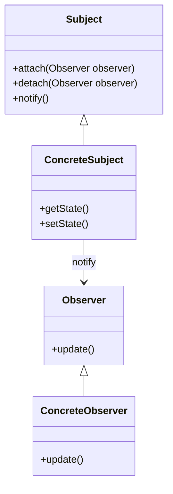

```mermaid
classDiagram
    class Subject {
        +attach(Observer observer)
        +detach(Observer observer)
        +notify()
    }

    class ConcreteSubject {
        +getState()
        +setState()
    }

    class Observer {
        +update()
    }

    class ConcreteObserver {
        +update()
    }

    Subject <|-- ConcreteSubject
    Observer <|-- ConcreteObserver
    ConcreteSubject --> Observer : notify
```
