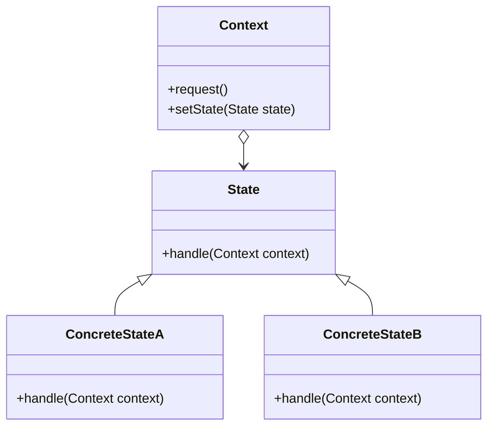

# State

The **State** pattern allows an object to alter its behavior when its internal state changes. The object will appear to change its class. This pattern is useful when an object can have different behaviors depending on its state and needs to change dynamically between them.

## Diagram

## Example

In this directory, you can find examples of how to implement the pattern in **C#** and **Python**, as well as a **Mermaid** diagram illustrating the basic structure of the pattern.

- **C#**: Example with classes implementing the State pattern to dynamically change an object's behavior based on its state.
- **Python**: A similar example that shows how objects change their behavior based on their state.

**SPANISH VERSION / VERSIÓN EN ESPAÑOL:** For the Spanish version of this file, **click [here](README_ES.md)**.
