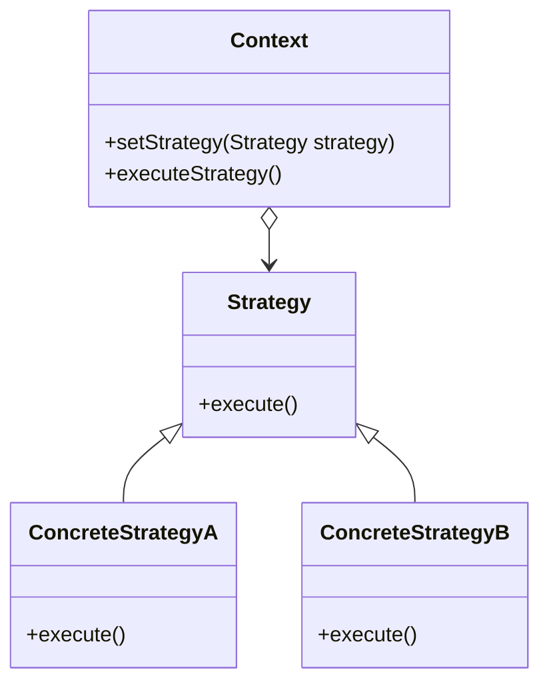

```mermaid
classDiagram
    class Context {
        +setStrategy(Strategy strategy)
        +executeStrategy()
    }

    class Strategy {
        +execute()
    }

    class ConcreteStrategyA {
        +execute()
    }

    class ConcreteStrategyB {
        +execute()
    }

    Context o--> Strategy
    Strategy <|-- ConcreteStrategyA
    Strategy <|-- ConcreteStrategyB
```
