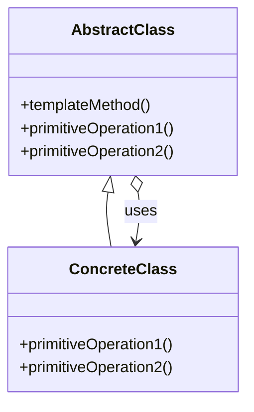

# Template Method

The **Template Method** pattern defines the skeleton of an algorithm in an operation, deferring some steps to subclasses. This pattern lets subclasses redefine certain steps of an algorithm without changing its structure.

## Diagram

## Example

In this directory, you can find examples of how to implement the pattern in **C#** and **Python**, as well as a **Mermaid** diagram illustrating the basic structure of the pattern.

- **C#**: Example with classes implementing the Template Method pattern to define an algorithm template with steps that subclasses can override.
- **Python**: A similar example that shows how to define a base algorithm and allow subclasses to modify specific steps.

**SPANISH VERSION / VERSIÓN EN ESPAÑOL:** For the Spanish version of this file, **click [here](README_ES.md)**.
