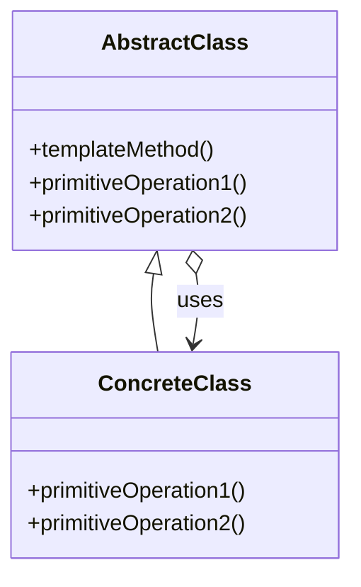

# Template Method

El patrón **Template Method** define el esqueleto de un algoritmo en una operación, diferiendo algunos pasos a las subclases. Este patrón permite que las subclases redefinan ciertos pasos de un algoritmo sin cambiar su estructura.

## Diagrama

## Ejemplo

En este directorio, puedes encontrar ejemplos de cómo implementar el patrón en **C#** y **Python**, así como un diagrama en **Mermaid** que ilustra la estructura básica del patrón.

- **C#**: Ejemplo con clases que implementan el patrón Template Method para definir una plantilla de algoritmo con pasos que las subclases pueden modificar.
- **Python**: Ejemplo similar que muestra cómo se puede definir un algoritmo base y permitir que las subclases cambien pasos específicos.

**SPANISH VERSION / VERSIÓN EN ESPAÑOL:** Para la versión en inglés de este archivo, haz clic [aquí](README.md).
