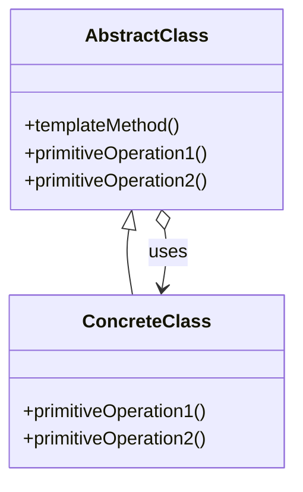

```mermaid
classDiagram
    class AbstractClass {
        +templateMethod()
        +primitiveOperation1()
        +primitiveOperation2()
    }

    class ConcreteClass {
        +primitiveOperation1()
        +primitiveOperation2()
    }

    AbstractClass <|-- ConcreteClass
    AbstractClass o--> ConcreteClass : uses
```
