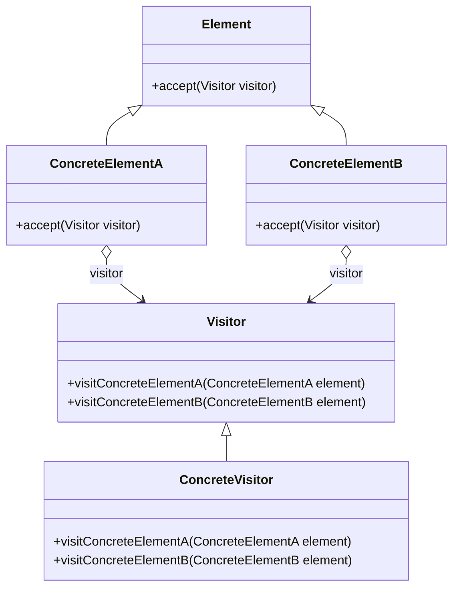

# Visitor

The **Visitor** pattern allows you to define new operations on a structure of objects without changing the classes of the objects on which it operates. This pattern is useful when you need to perform operations on a structure of objects and want to keep the behavior separate from the structure.

## Diagram

## Example

In this directory, you can find examples of how to implement the pattern in **C#** and **Python**, as well as a **Mermaid** diagram illustrating the basic structure of the pattern.

- **C#**: Example with classes implementing the Visitor pattern to perform operations on a structure of objects.
- **Python**: A similar example that shows how to separate behavior from the structure using the Visitor pattern.

**SPANISH VERSION / VERSIÓN EN ESPAÑOL:** For the Spanish version of this file, **click [here](README_ES.md)**.
