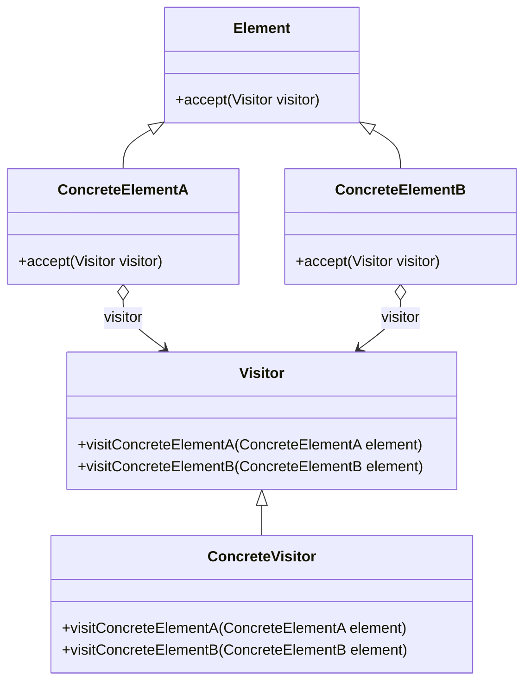

# Visitor

El patrón **Visitor** permite definir nuevas operaciones sobre una estructura de objetos sin cambiar las clases de los objetos sobre los que opera. Este patrón es útil cuando necesitas realizar operaciones sobre una estructura de objetos y deseas mantener separado el comportamiento de la estructura.

## Diagrama

## Ejemplo

En este directorio, puedes encontrar ejemplos de cómo implementar el patrón en **C#** y **Python**, así como un diagrama en **Mermaid** que ilustra la estructura básica del patrón.

- **C#**: Ejemplo con clases que implementan el patrón Visitor para realizar operaciones sobre una estructura de objetos.
- **Python**: Ejemplo similar que muestra cómo separar el comportamiento de la estructura utilizando el patrón Visitor.

**SPANISH VERSION / VERSIÓN EN ESPAÑOL:** Para la versión en inglés de este archivo, haz clic [aquí](README.md).
