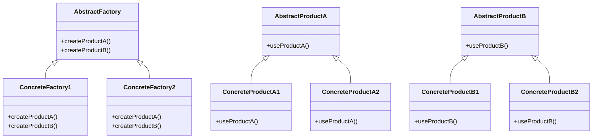

# Abstract Factory

The **Abstract Factory** pattern provides an interface for creating families of related or dependent objects without specifying their concrete classes. This pattern is useful when you want to create related objects without coupling to their concrete implementations.

## Diagram

## Example

In this directory, you can find examples of how to implement the pattern in **C#** and **Python**, as well as a **Mermaid** diagram illustrating the basic structure of the pattern.

- **C#**: Example with classes implementing the Abstract Factory pattern to create related products without specifying their concrete implementations.
- **Python**: A similar example that shows how to create families of related objects without depending on concrete classes.

**SPANISH VERSION / VERSIÓN EN ESPAÑOL:** For the Spanish version of this file, **click [here](README_ES.md)**.
