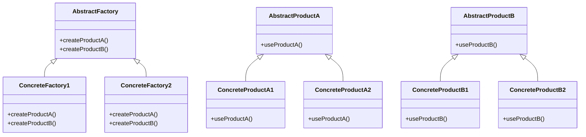

# Abstract Factory

El patrón **Abstract Factory** proporciona una interfaz para crear familias de objetos relacionados o dependientes sin especificar sus clases concretas. Este patrón es útil cuando se desea crear objetos relacionados sin acoplarse a sus implementaciones concretas.

## Diagrama

## Ejemplo

En este directorio, puedes encontrar ejemplos de cómo implementar el patrón en **C#** y **Python**, así como un diagrama en **Mermaid** que ilustra la estructura básica del patrón.

- **C#**: Ejemplo con clases que implementan el patrón Abstract Factory para crear productos relacionados sin especificar sus implementaciones concretas.
- **Python**: Ejemplo similar que muestra cómo crear familias de objetos relacionados sin depender de clases concretas.

**SPANISH VERSION / VERSIÓN EN ESPAÑOL:** Para la versión en inglés de este archivo, haz clic [aquí](README.md).
