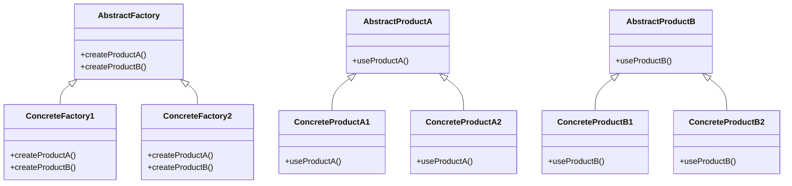

```mermaid
classDiagram
    class AbstractFactory {
        +createProductA()
        +createProductB()
    }

    class ConcreteFactory1 {
        +createProductA()
        +createProductB()
    }

    class ConcreteFactory2 {
        +createProductA()
        +createProductB()
    }

    class AbstractProductA {
        +useProductA()
    }

    class AbstractProductB {
        +useProductB()
    }

    class ConcreteProductA1 {
        +useProductA()
    }

    class ConcreteProductA2 {
        +useProductA()
    }

    class ConcreteProductB1 {
        +useProductB()
    }

    class ConcreteProductB2 {
        +useProductB()
    }

    AbstractFactory <|-- ConcreteFactory1
    AbstractFactory <|-- ConcreteFactory2
    AbstractProductA <|-- ConcreteProductA1
    AbstractProductA <|-- ConcreteProductA2
    AbstractProductB <|-- ConcreteProductB1
    AbstractProductB <|-- ConcreteProductB2
```
