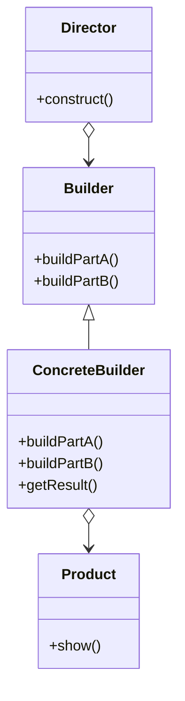

# Builder

El patrón **Builder** separa la construcción de un objeto complejo de su representación, permitiendo que el mismo proceso de construcción cree diferentes representaciones. Es útil cuando la creación de un objeto implica varios pasos.

## Diagrama

## Ejemplo

En este directorio, puedes encontrar ejemplos de cómo implementar el patrón en **C#** y **Python**, así como un diagrama en **Mermaid** que ilustra la estructura básica del patrón.

- **C#**: Ejemplo con clases que implementan el patrón Builder para construir un producto paso a paso.
- **Python**: Ejemplo similar que muestra cómo construir un objeto complejo en diferentes etapas.

**SPANISH VERSION / VERSIÓN EN ESPAÑOL:** Para la versión en inglés de este archivo, haz clic [aquí](README.md).
