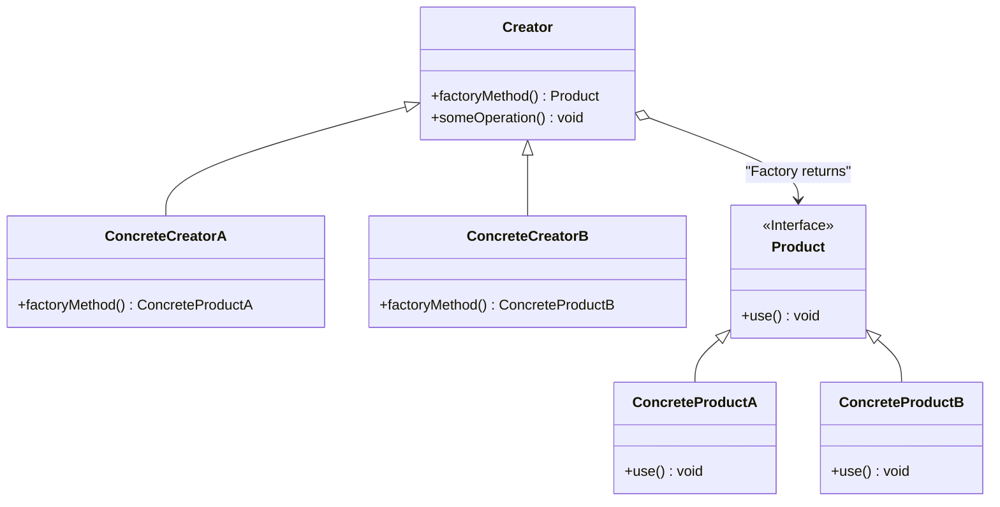

# Factory Method

The **Factory Method** pattern defines an interface for creating an object, but lets subclasses decide which class to instantiate. The Factory Method lets a class defer instantiation to subclasses.

## Diagram

## Example

In this directory, you can find examples of how to implement the pattern in **C#** and **Python**, as well as a **Mermaid** diagram illustrating the basic structure of the pattern.

- **C#**: Example with classes implementing the Factory Method pattern to delegate the creation of objects to subclasses.
- **Python**: A similar example that shows how subclasses can decide which instances to create.

**SPANISH VERSION / VERSIÓN EN ESPAÑOL:** For the Spanish version of this file, **click [here](README_ES.md)**.
