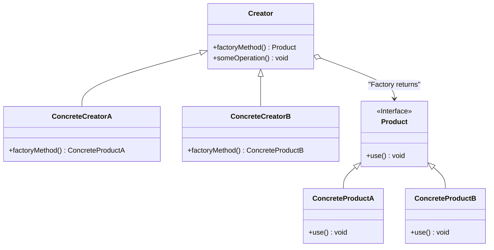

# Factory Method

El patrón **Factory Method** define una interfaz para crear un objeto, pero deja que las subclases decidan qué clase instanciar. El Factory Method permite a una clase delegar la creación de objetos a las subclases.

## Diagrama

## Ejemplo

En este directorio, puedes encontrar ejemplos de cómo implementar el patrón en **C#** y **Python**, así como un diagrama en **Mermaid** que ilustra la estructura básica del patrón.

- **C#**: Ejemplo con clases que implementan el patrón Factory Method para delegar la creación de objetos a las subclases.
- **Python**: Ejemplo similar que muestra cómo las subclases pueden decidir qué instancias crear.

**SPANISH VERSION / VERSIÓN EN ESPAÑOL:** Para la versión en inglés de este archivo, haz clic [aquí](README.md).
