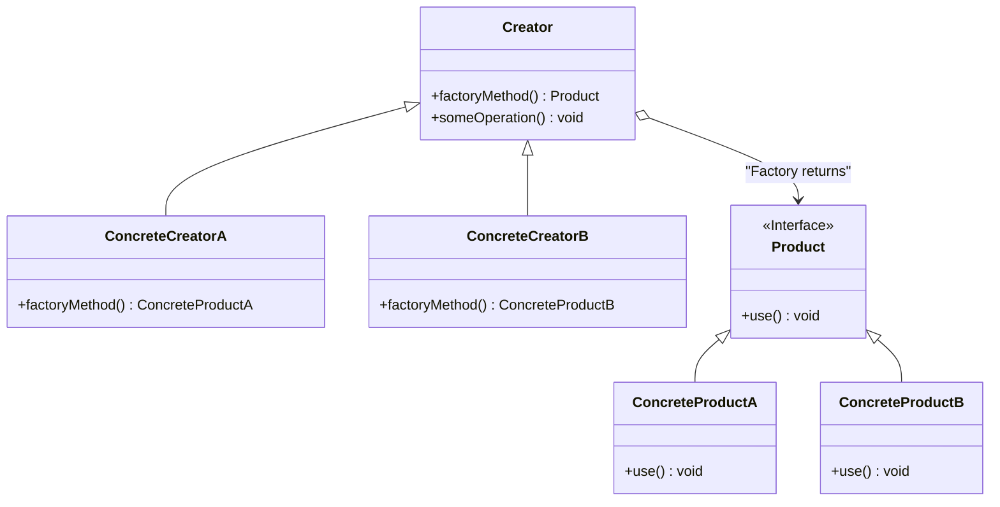

```mermaid
classDiagram
    class Creator {
        +factoryMethod() Product
        +someOperation() void
    }

    class ConcreteCreatorA {
        +factoryMethod() ConcreteProductA
    }

    class ConcreteCreatorB {
        +factoryMethod() ConcreteProductB
    }

    class Product {
        <<Interface>>
        +use() void
    }

    class ConcreteProductA {
        +use() void
    }

    class ConcreteProductB {
        +use() void
    }

    Creator o--> Product : "Factory returns"
    Creator <|-- ConcreteCreatorA
    Creator <|-- ConcreteCreatorB
    Product <|-- ConcreteProductA
    Product <|-- ConcreteProductB

```
