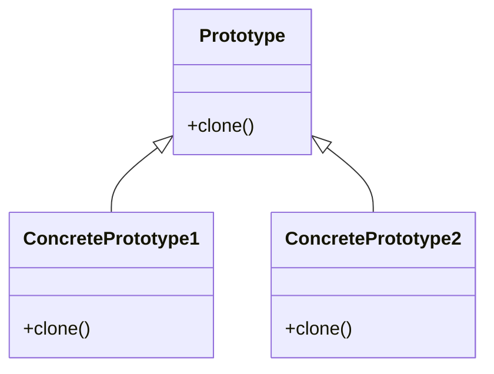

# Prototype

The **Prototype** pattern allows you to copy existing objects without depending on their classes, making it possible to add or remove objects at runtime. This pattern is useful when object creation is costly, and you need to copy an object rather than create a new one from scratch.

## Diagram

## Example

In this directory, you can find examples of how to implement the pattern in **C#** and **Python**, as well as a **Mermaid** diagram illustrating the basic structure of the pattern.

- **C#**: Example with classes implementing the Prototype pattern to clone objects without creating instances from scratch.
- **Python**: A similar example that shows how to copy existing objects using the Prototype pattern.

**SPANISH VERSION / VERSIÓN EN ESPAÑOL:** For the Spanish version of this file, **click [here](README_ES.md)**.
