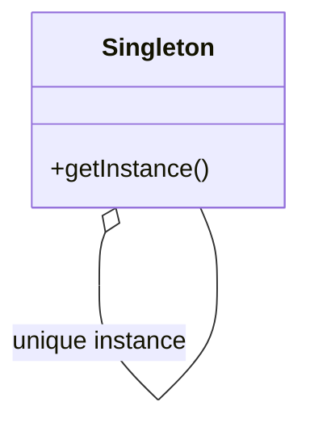

# Singleton

The **Singleton** pattern ensures that a class has only one instance and provides a global point of access to that instance. This pattern is useful when you need to control access to a shared resource or ensure that an object has a single instance throughout the system.

## Diagram

## Example

In this directory, you can find examples of how to implement the pattern in **C#** and **Python**, as well as a **Mermaid** diagram illustrating the basic structure of the pattern.

- **C#**: Example with classes implementing the Singleton pattern to control the creation of class instances.
- **Python**: A similar example that shows how to ensure a single instance of a class using the Singleton pattern.

**SPANISH VERSION / VERSIÓN EN ESPAÑOL:** For the Spanish version of this file, **click [here](README_ES.md)**.
