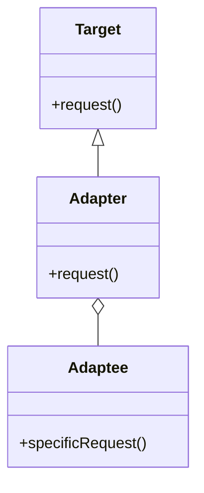

# Adapter

The **Adapter** pattern converts the interface of a class into another interface that the client expects. This pattern allows classes with incompatible interfaces to work together.

## Diagram

## Example

In this directory, you can find examples of how to implement the pattern in **C#** and **Python**, as well as a **Mermaid** diagram illustrating the basic structure of the pattern.

- **C#**: Example with classes implementing the Adapter pattern to convert an incompatible interface into a compatible one.
- **Python**: A similar example that shows how classes with incompatible interfaces can work together using the Adapter pattern.

**SPANISH VERSION / VERSIÓN EN ESPAÑOL:** For the Spanish version of this file, **click [here](README_ES.md)**.
