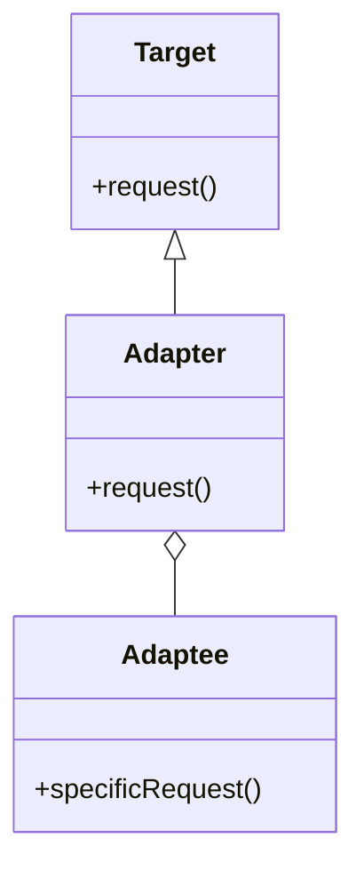

```mermaid
classDiagram
    class Target {
        +request()
    }

    class Adapter {
        +request()
    }

    class Adaptee {
        +specificRequest()
    }

    Target <|-- Adapter
    Adapter o-- Adaptee
```
