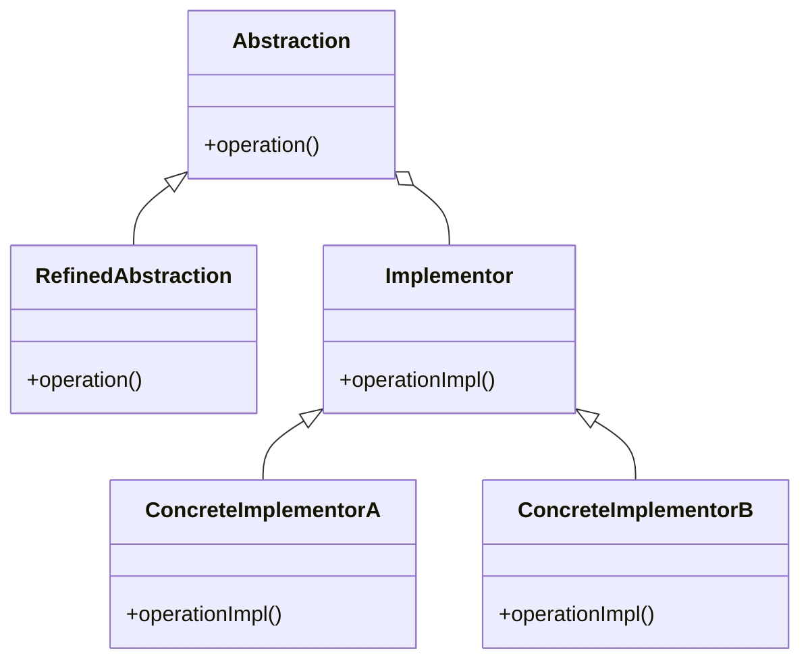

# Bridge

The **Bridge** pattern decouples an abstraction from its implementation, allowing them to vary independently. This pattern is useful when a class can have multiple implementation variants.

## Diagram

## Example

In this directory, you can find examples of how to implement the pattern in **C#** and **Python**, as well as a **Mermaid** diagram illustrating the basic structure of the pattern.

- **C#**: Example with classes implementing the Bridge pattern to decouple an abstraction from its implementation.
- **Python**: A similar example that shows how to decouple an abstraction from its implementation using the Bridge pattern.

**SPANISH VERSION / VERSIÓN EN ESPAÑOL:** For the Spanish version of this file, **click [here](README_ES.md)**.
