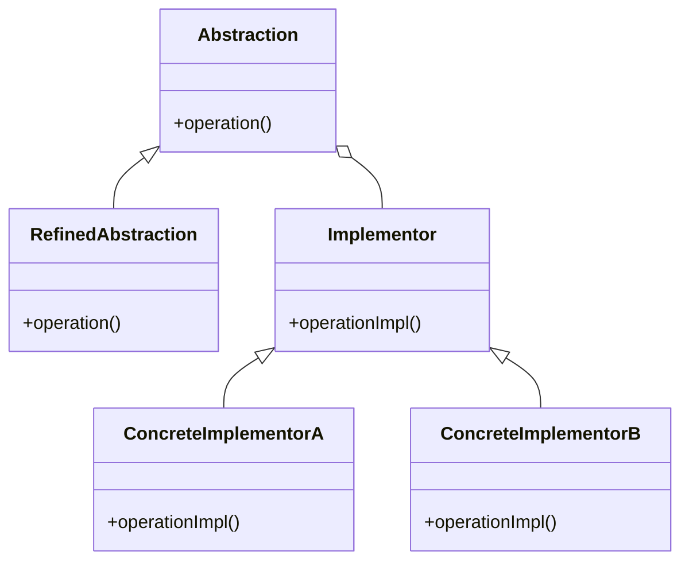

# Bridge

El patrón **Bridge** desacopla una abstracción de su implementación, permitiendo que ambas varíen de forma independiente. Este patrón es útil cuando una clase puede tener múltiples variantes de implementación.

## Diagrama

## Ejemplo

En este directorio, puedes encontrar ejemplos de cómo implementar el patrón en **C#** y **Python**, así como un diagrama en **Mermaid** que ilustra la estructura básica del patrón.

- **C#**: Ejemplo con clases que implementan el patrón Bridge para separar una abstracción de su implementación.
- **Python**: Ejemplo similar que muestra cómo desacoplar una abstracción de su implementación usando el patrón Bridge.

**SPANISH VERSION / VERSIÓN EN ESPAÑOL:** Para la versión en inglés de este archivo, haz clic [aquí](README.md).
