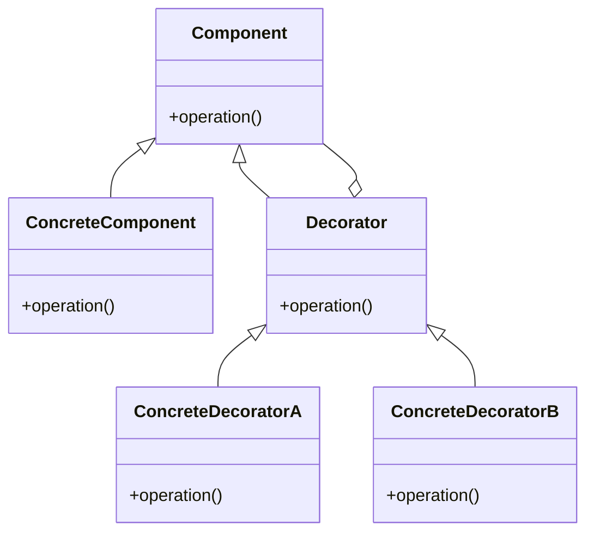

# Decorator

El patrón **Decorator** permite agregar comportamiento a objetos individuales, ya sea de manera estática o dinámica, sin afectar el comportamiento de otros objetos del mismo tipo. Este patrón es útil cuando se desea añadir responsabilidades a los objetos de forma flexible.

## Diagrama

## Ejemplo

En este directorio, puedes encontrar ejemplos de cómo implementar el patrón en **C#** y **Python**, así como un diagrama en **Mermaid** que ilustra la estructura básica del patrón.

- **C#**: Ejemplo con clases que implementan el patrón Decorator para añadir comportamiento adicional a los objetos de manera dinámica.
- **Python**: Ejemplo similar que muestra cómo decorar objetos con responsabilidades adicionales usando el patrón Decorator.

**SPANISH VERSION / VERSIÓN EN ESPAÑOL:** Para la versión en inglés de este archivo, haz clic [aquí](README.md).
